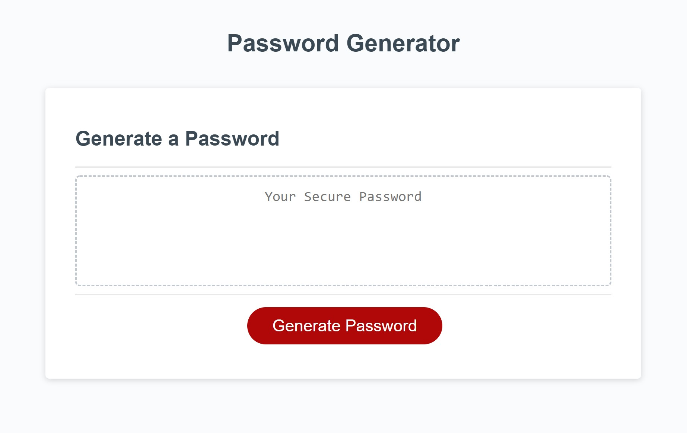
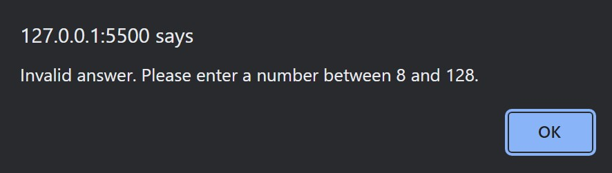
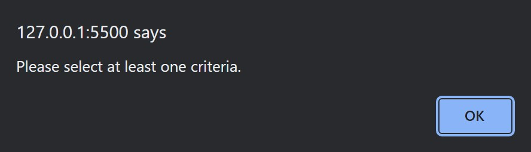

# password-generator
This password generator generates a random password based upon the user's selected criteria. 

## How to Use Password Generator
This is how the app looks at first:

1. When the user clicks on the red button, "Generate Password", the user is prompt with entering a number for their desired character amount with restriction between 8 and 128. If their input is not a number or is an invalid number, the user is given the alert that warns them, "Invalid answer. Please enter a number between 8 and 128".
2. After, the user is prompted with criterias that ask what would the user like for their password to include such as lowercase, uppercase, numbers, and special characters. User must select at least one criteria to be included or else they are given the alert of "Please select at least one criteria".
3. Once user selects at least one desired criteria and they are given a random generated password. In the picture's case, the user selected "OK" to all criteria.

## Additional Pictures
When user enters invalid input for character amount:

When user fails to select any criteria to include in their generated password:

